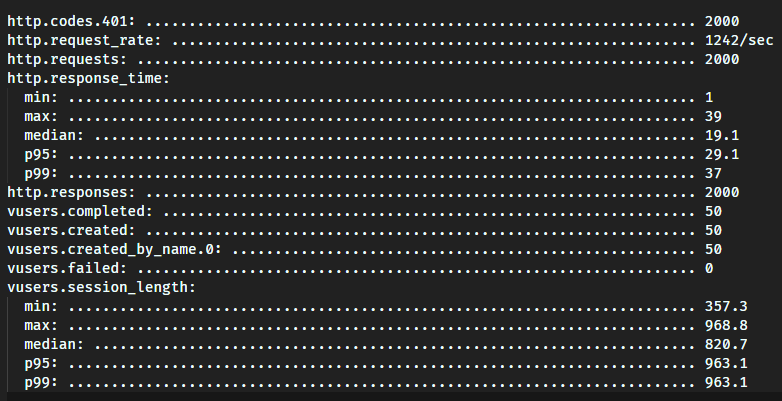
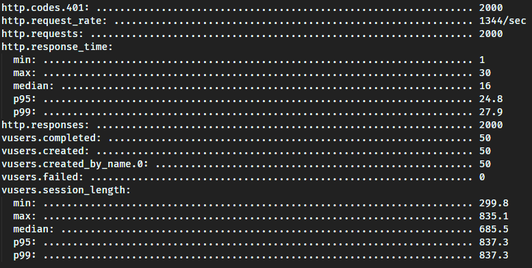

# Desafio - 15
## Desplegar nuestro proyecto en la nube
</br>
</br>

## Lista de comandos utilizados en local :

```
nodemon server 8081 FORK
nodemon server 8082 CLUSTER

```

# Rutas

[Home](https://ecomcerce-32125.up.railway.app/)

[Login](https://ecomcerce-32125.up.railway.app/auth/login)

[Register](https://ecomcerce-32125.up.railway.app/auth/register)

[Cart List](https://ecomcerce-32125.up.railway.app/cart)


#

# Resultados de comparación fork vs. cluster con Artillery

* ## **Fork**


* ## **Cluster**



